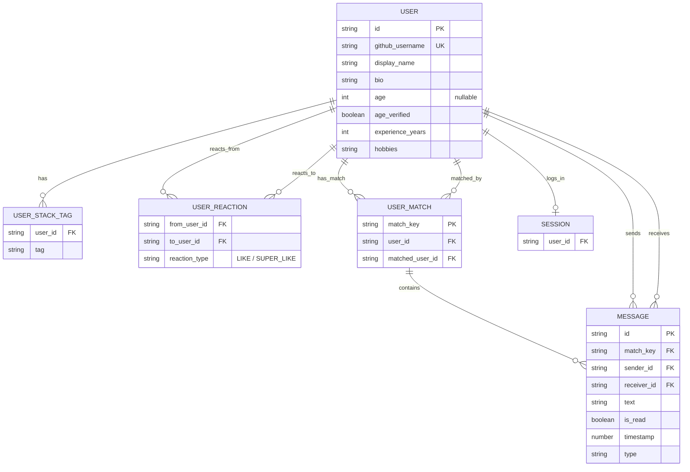

# ER図

## 補足
- `match_key` は実装上 `sort(userId, matchId).join('-')` で生成されます。
- 現在のコードでは `likedUserIds` / `superLikedUserIds` / `matches` / `stackTags` は `USER` 内の配列ですが、ER図では関係を明確にするため中間エンティティへ正規化して表現しています。
- `SESSION` は `matchmaking_session` キーで保持している「現在ログイン中ユーザー」を表します。
