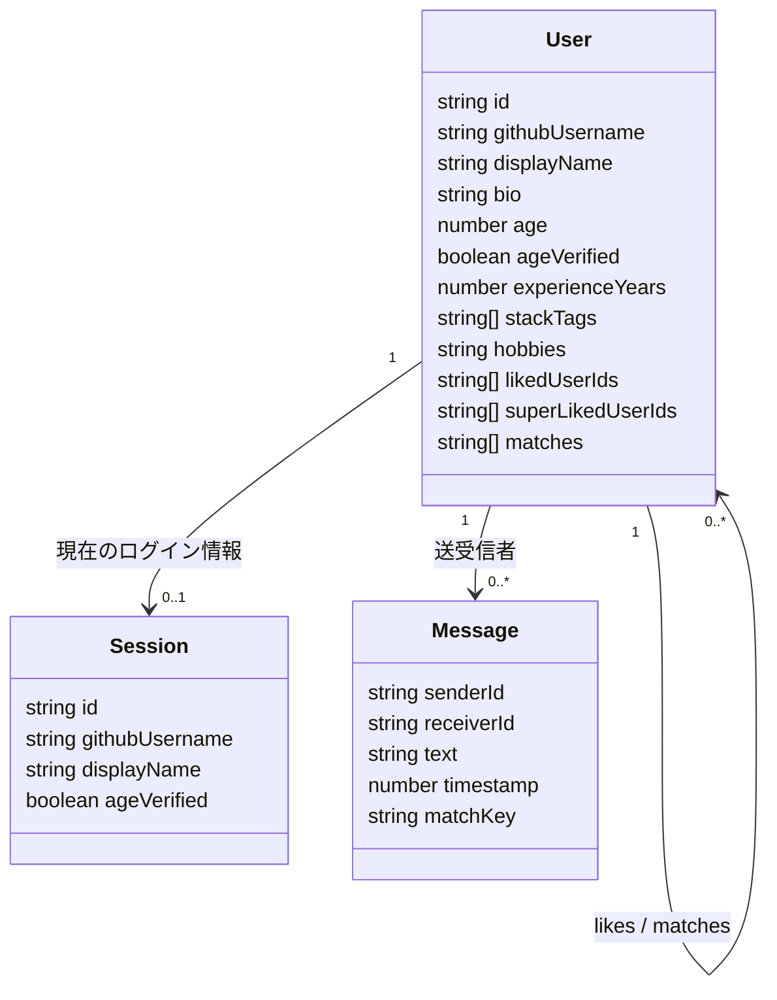

# データモデル概要

## 保存単位

| 保存先 | 主な用途 | 代表データ |
| --- | --- | --- |
| `matchmaking_users` | ユーザ一覧とプロフィール管理 | ユーザ情報、いいね、マッチ状態 |
| `matchmaking_session` | 現在のログイン状態の保持 | 現在ユーザの簡易セッション情報 |
| `matchmaking_chat_<userId>-<matchId>` | マッチ相手ごとのチャット履歴 | メッセージ配列 |

## Mermaid

## 補足

- `User.matches` は相互いいね成立後の相手IDを保持します。
- `likedUserIds` と `superLikedUserIds` は送信済みの反応を重複なく管理します。
- チャット通知は `BroadcastChannel` を優先し、未対応環境では `storage` イベントで同期します。