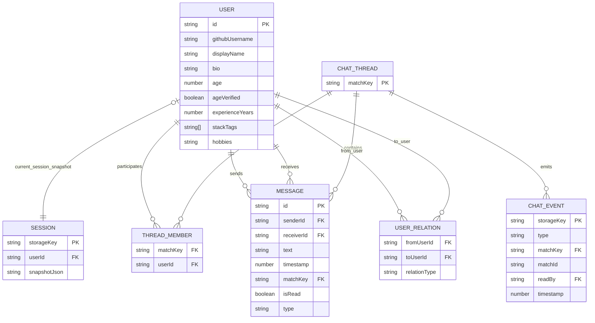
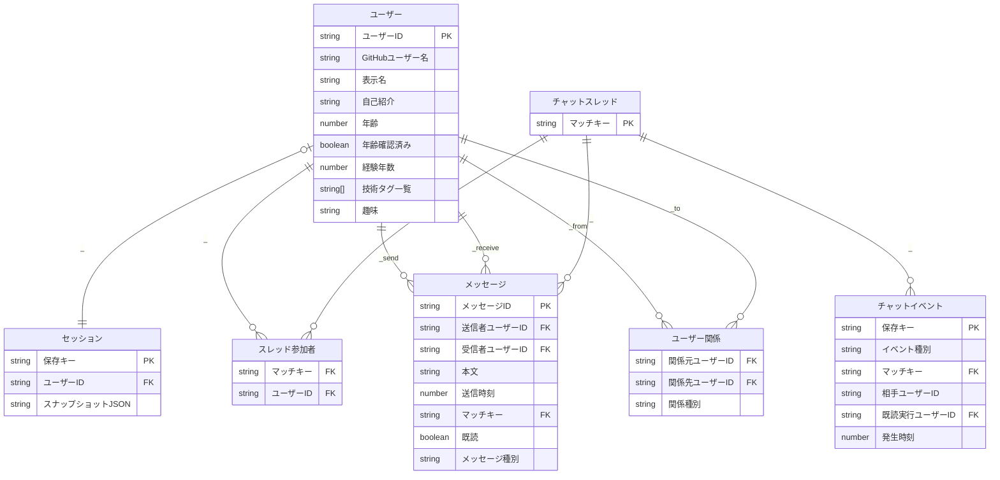

# データモデル概要

## 保存単位

| 保存先 | 主な用途 | 代表データ |
| --- | --- | --- |
| `matchmaking_users` | ユーザ一覧とプロフィール管理 | ユーザ情報、いいね、マッチ状態 |
| `matchmaking_session` | 現在のログイン状態の保持 | 現在ユーザのスナップショット |
| `matchmaking_chat_<matchKey>` | マッチ相手ごとのチャット履歴 | `matchKey` ごとのメッセージ配列 |
| `matchmaking_chat_event` | BroadcastChannel未対応時の更新通知 | 新着メッセージ / 既読イベント |

## Mermaid

```mermaid
erDiagram
  USER {
    string id PK
    string githubUsername
    string displayName
    string bio
    number age
    boolean ageVerified
    number experienceYears
    string[] stackTags
    string hobbies
  }

  SESSION {
    string storageKey PK
    string userId FK
    string snapshotJson
  }

  CHAT_THREAD {
    string matchKey PK
  }

  THREAD_MEMBER {
    string matchKey FK
    string userId FK
  }

  USER_RELATION {
    string fromUserId FK
    string toUserId FK
    string relationType
  }

  MESSAGE {
    string id PK
    string senderId FK
    string receiverId FK
    string text
    number timestamp
    string matchKey FK
    boolean isRead
    string type
  }

  CHAT_EVENT {
    string storageKey PK
    string type
    string matchKey FK
    string matchId
    string readBy FK
    number timestamp
  }

  USER o|--|| SESSION : current_session_snapshot
  USER ||--o{ THREAD_MEMBER : participates
  CHAT_THREAD ||--o{ THREAD_MEMBER : has_members
  USER ||--o{ MESSAGE : sends
  USER ||--o{ MESSAGE : receives
  CHAT_THREAD ||--o{ MESSAGE : contains
  CHAT_THREAD ||--o{ CHAT_EVENT : emits
  USER ||--o{ USER_RELATION : from_user
  USER ||--o{ USER_RELATION : to_user
```

## Mermaid（日本語ラベル版）

```mermaid
erDiagram
  ユーザー {
    string ユーザーID PK
    string GitHubユーザー名
    string 表示名
    string 自己紹介
    number 年齢
    boolean 年齢確認済み
    number 経験年数
    string[] 技術タグ一覧
    string 趣味
  }

  セッション {
    string 保存キー PK
    string ユーザーID FK
    string スナップショットJSON
  }

  チャットスレッド {
    string マッチキー PK
  }

  スレッド参加者 {
    string マッチキー FK
    string ユーザーID FK
  }

  ユーザー関係 {
    string 関係元ユーザーID FK
    string 関係先ユーザーID FK
    string 関係種別
  }

  メッセージ {
    string メッセージID PK
    string 送信者ユーザーID FK
    string 受信者ユーザーID FK
    string 本文
    number 送信時刻
    string マッチキー FK
    boolean 既読
    string メッセージ種別
  }

  チャットイベント {
    string 保存キー PK
    string イベント種別
    string マッチキー FK
    string 相手ユーザーID
    string 既読実行ユーザーID FK
    number 発生時刻
  }

  ユーザー o|--|| セッション : _
  ユーザー ||--o{ スレッド参加者 : _
  チャットスレッド ||--o{ スレッド参加者 : _
  ユーザー ||--o{ メッセージ : _send
  ユーザー ||--o{ メッセージ : _receive
  チャットスレッド ||--o{ メッセージ : _
  チャットスレッド ||--o{ チャットイベント : _
  ユーザー ||--o{ ユーザー関係 : _from
  ユーザー ||--o{ ユーザー関係 : _to
```

### 日本語カラム一覧（型なし）

| エンティティ | カラム |
| --- | --- |
| `ユーザー` | ユーザーID, GitHubユーザー名, 表示名, 自己紹介, 年齢, 年齢確認済み, 経験年数, 技術タグ一覧, 趣味 |
| `セッション` | 保存キー, ユーザーID, スナップショットJSON |
| `チャットスレッド` | マッチキー |
| `スレッド参加者` | マッチキー, ユーザーID |
| `ユーザー関係` | 関係元ユーザーID, 関係先ユーザーID, 関係種別 |
| `メッセージ` | メッセージID, 送信者ユーザーID, 受信者ユーザーID, 本文, 送信時刻, マッチキー, 既読, メッセージ種別 |
| `チャットイベント` | 保存キー, イベント種別, マッチキー, 相手ユーザーID, 既読実行ユーザーID, 発生時刻 |

## 補足

- `User.matches` は相互いいね成立後の相手IDを保持します。
- `likedUserIds` と `superLikedUserIds` は送信済みの反応を重複なく管理します。
- `matchmaking_session` はユーザごとのセッション一覧ではなく、現在のアクティブセッション1件を保持します。
- `Session` は保存時点のユーザ情報をそのまま保持するスナップショットです（実装では `snapshotJson` 相当）。
- `matchKey` は2ユーザIDをソートして `-` 連結した会話スレッドIDです。
- `Message.type` は通常送信時に `message` を保持し、既読通知は `ChatEvent.type = read` で表現します。
- `Message.isRead` は受信者がチャットを開いたタイミングで `true` になります。
- 初期サンプルメッセージには `id` `isRead` `type` が含まれない場合があります。
- 既読同期時は `type: read` の通知イベントを発行します。
- 1つの `ChatThread` の参加者は常に2ユーザです。
- 各 `Message` には送信者と受信者の2ユーザが関与します。
- `USER_RELATION.relationType` は `like` `superLike` `match` を想定した論理表現です。
- 実装では `likedUserIds` `superLikedUserIds` `matches` を `USER` レコード内のID配列として保持し、`USER_RELATION` は持ちません。
- 実装では `THREAD_MEMBER` テーブルを持たず、`matchKey` から参加者ペアを表現します。
- `ChatEvent` は個々の `Message` ではなく、`ChatThread` 単位の更新通知を表します。
- チャット通知は `BroadcastChannel` を優先し、未対応環境では `storage` イベントで同期します。
- 日本語ラベル版は英語版と同じ構造で、テーブル名・属性名を日本語化しています。
- 利用環境の Mermaid `erDiagram` パーサでは関係行の `:` が必須のため、日本語版の関係ラベルは簡易英字で最小限にしています。
