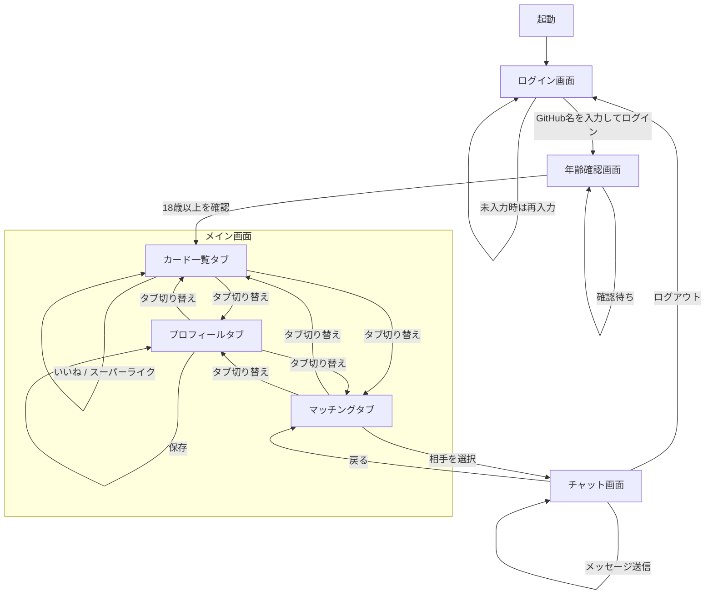

# 画面遷移図

```mermaid
flowchart TD
  Start[起動] --> Login[ログイン画面]
  Login -->|GitHub名を入力してログイン| AgeCheck[年齢確認画面]
  Login -->|未入力時は再入力| Login

  AgeCheck -->|18歳以上を確認| Users[カード一覧タブ]
  AgeCheck -->|確認待ち| AgeCheck

  subgraph MainArea[メイン画面]
    direction TB
    Users
    Profile[プロフィールタブ]
    Matches[マッチングタブ]
  end

  Users -->|いいね / スーパーライク| Users
  Users -->|タブ切り替え| Profile
  Users -->|タブ切り替え| Matches

  Profile -->|保存| Profile
  Profile -->|タブ切り替え| Users
  Profile -->|タブ切り替え| Matches

  Matches -->|相手を選択| Chat[チャット画面]
  Matches -->|タブ切り替え| Users
  Matches -->|タブ切り替え| Profile

  Chat -->|メッセージ送信| Chat
  Chat -->|戻る| Matches
  Chat -->|ログアウト| Login
```

## 補足

- 実装上は、未ログイン時はログイン画面、年齢未確認時は年齢確認画面、確認済みならメイン画面を表示します。
- メイン画面の初期表示はカード一覧タブです。
- メイン画面では「カード」「プロフィール」「マッチング」をタブで切り替えます。
- チャット画面はマッチ相手を選択した場合に表示します。
