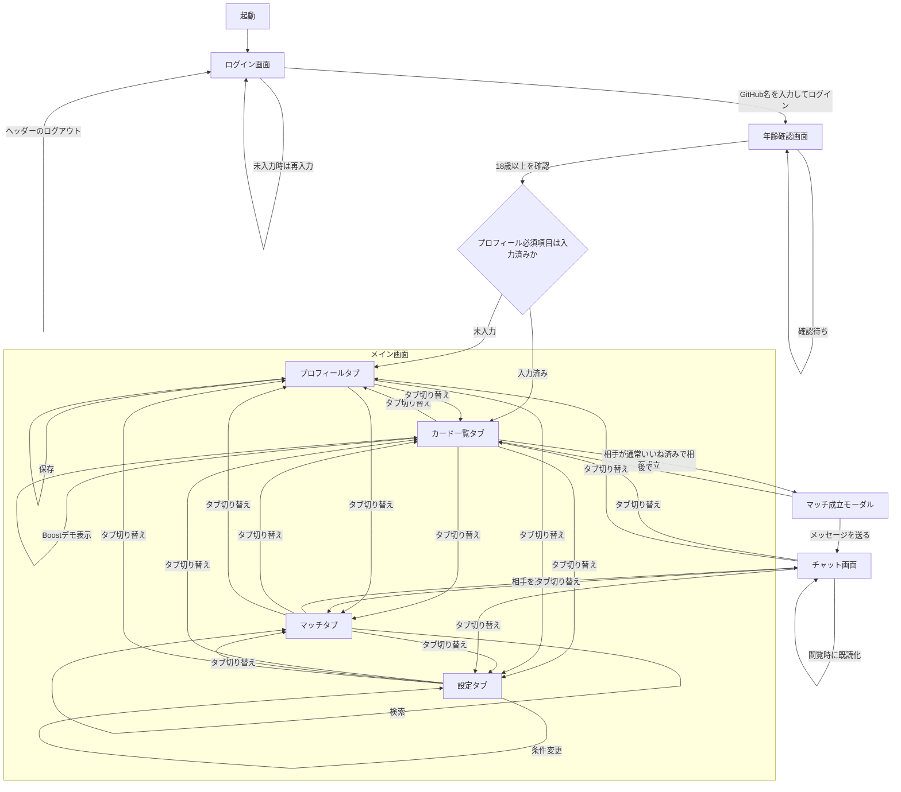

# 画面遷移図

## 補足

- 実装上は、未ログイン時はログイン画面、年齢未確認時は年齢確認画面、確認済みならメイン画面を表示します。
- 年齢確認後、必須プロフィール（技術スタックと経験年数）が不足している場合はプロフィールタブへ誘導します。
- メイン画面の初期表示はカード一覧タブです。
- メイン画面では「カード」「マッチ」「プロフィール」「設定」をタブで切り替えます。
- チャット画面は下部ナビゲーションから他タブへ移動できます。
- マッチ成立モーダルは、相手の `likedUserIds` に現在ユーザIDが含まれる場合に表示されます。
- マッチ成立後は、モーダルを経由せずマッチタブからチャットへ入るケースもあります。
